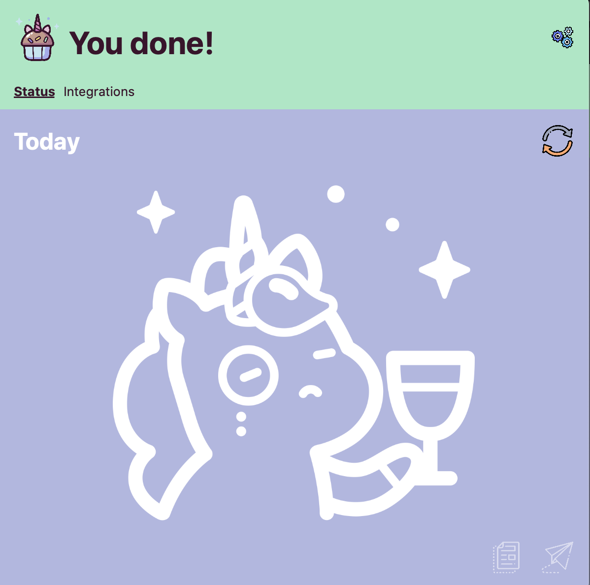
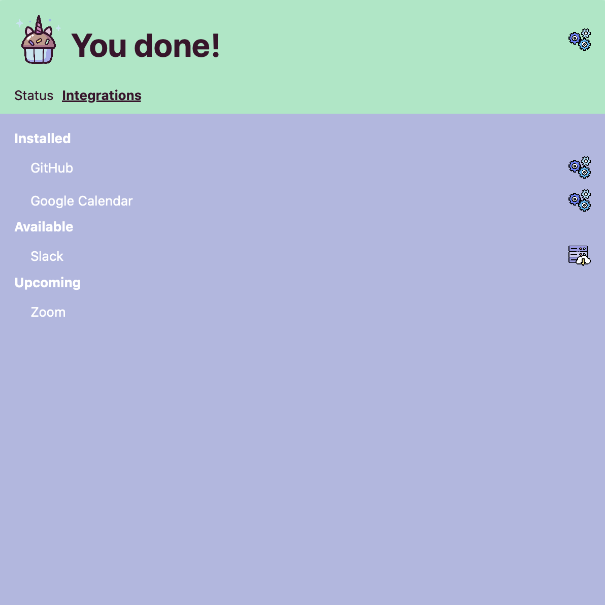
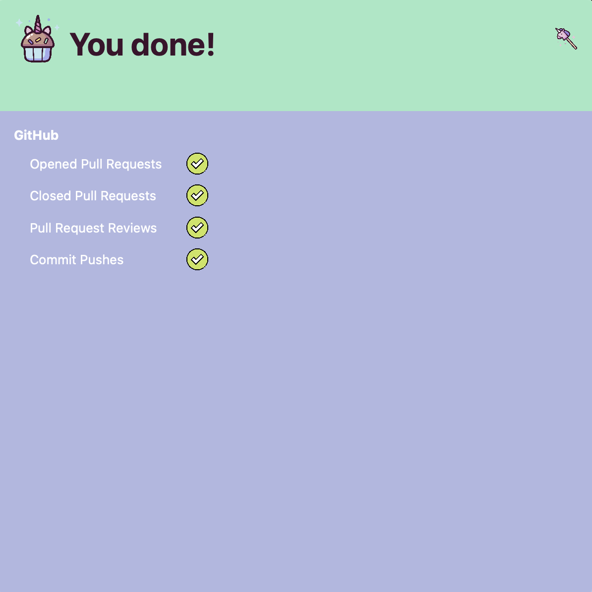
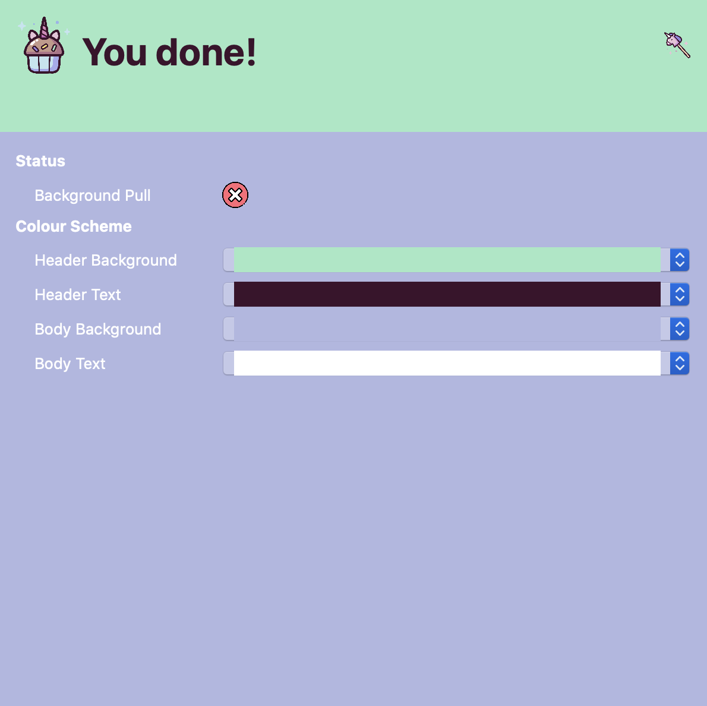
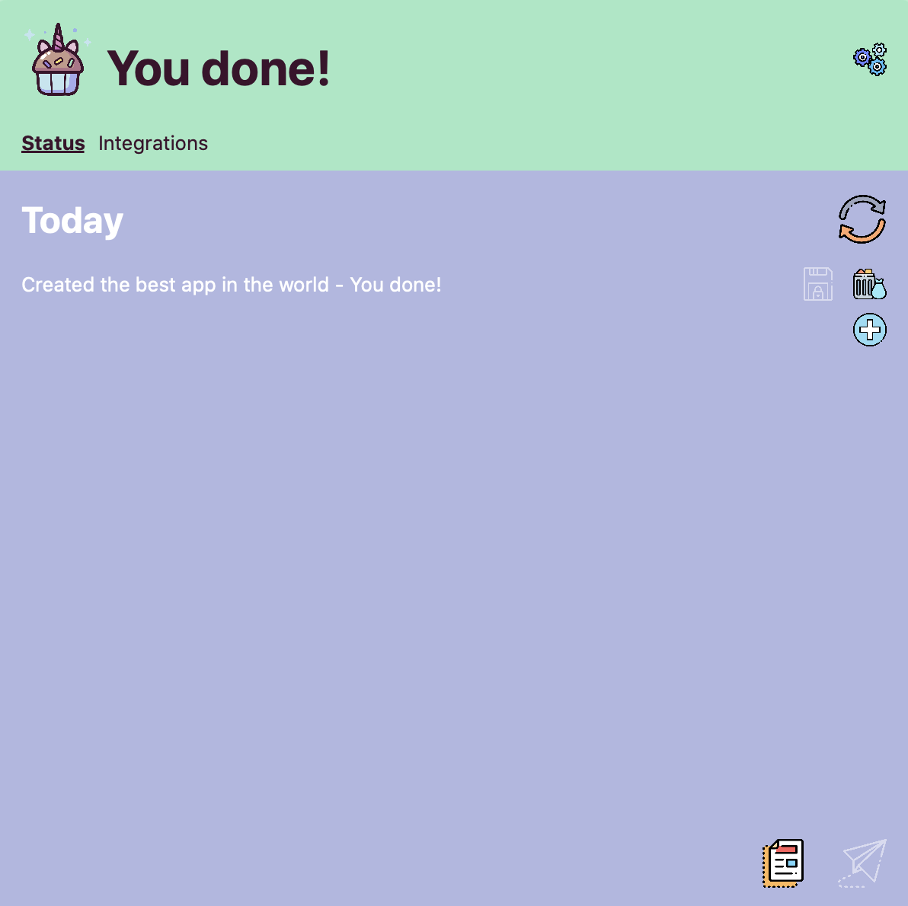

# [You done!](https://youd.one)

## What can I do in You done!?

1. Enjoy the look of this magnificent unicorn when your status is empty.

2. Install your favorite integrations (GitHub, Google Calendar, Slack, Zoom).

3. Configure the integrations so that the events you want contribute to the status.

4. Configure You done! so that it does what you want and it looks fabulous doing it.

5. Prepare the status and send it to Slack or copy it to Clipboard.

## Attributions

Icons made by [Freepik](https://www.flaticon.com/authors/freepik) from [Flaticon](https://www.flaticon.com).
